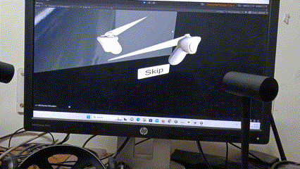
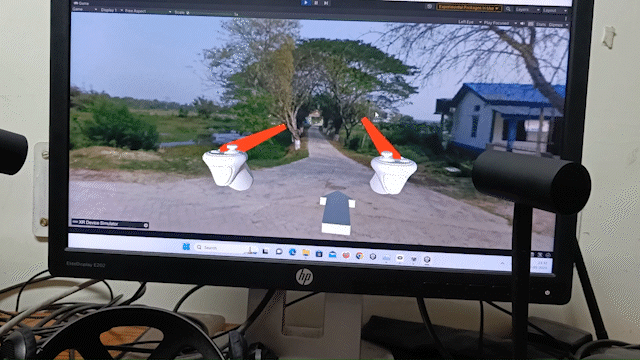

# Documentation for user

## Table of Contents
- [Documentation for user](#documentation-for-user)
  - [Table of Contents](#table-of-contents)
  - [Group 2](#group-2)
    - [Members](#members)
    - [Project Description](#project-description)
    - [Demo](#demo)
        - [Start of the tour](#start-of-the-tour)
        - [The interplace teleportation](#the-interplace-teleportation)
        - [Navigation](#navigation)
        - [Intraplace teleportation](#intraplace-teleportation)
        - [Information and videos](#information-and-videos)
    - [Running the project](#running-the-project)

## Group 2
>This file contains some gifs to show how the functionality takes place. It is recommended to use the markdown file for better image rendering.
### Members

| S.No | Name | Roll No. |
| ----------- | ----------- | ------- |
| 1 | Satvik Tiwari | 200101091 |
| 2 | Pranjal Baranwal | 200101083 |
| 3 | Pauras Manoj Tarle |200101074
| 4 | Yash Garg | 200101113 |
| 5 | Abhinav Kumar Choudhary |200101005|
| 6 | Hemant Kumar Meena | 200101041 |

### Project Description
This project was made for the preservation of a river island named Majuli. This project has the following features:
1. A website for automated map making.
2. A virtual reality tour of the island having the following:
    * Smooth transitions
    * Tablet 
    * Interplace teleportation showing location changes in the map
    * Intraplace Transitions using a Depth first search from the current place to the destination place
    * Location Awareness
    * Ambient audio
    * Notifications
    * Videos at some places
    * Information regarding a place

### Demo

### Start of the tour
First, it will show a black screen with a play button in the center. Tap on it to start the tour.

After this there would be a skip button at the bottom right of the screen, tap on it to skip the intro.

Then you will be shown a 360 degree interactive video of a boat which is roughly 8 seconds long.

After this completes you will be present on a ghat. You can look around by moving your head. Here you can open your tablet using the primary button of your left hand controller.

### The interplace teleportation

When you open tablet there will be a button named "Majuli Map" on the top right corner of the screen. Tap on it (using the raycast present at the tip of your right/left hand controller) to open the map. Then you will have a dropdown at the bottom of your screen showing various locations. Tap on any of them to teleport to that location.
Then click the "go here" button to teleport to that location.

Then you will be teleported to that location.

### Navigation

Now after you are present at a location, you can look around by moving your head. You can also move around by using the primary button of right hand controller. You can only go to a place where an arrow is shown to you. The movements have smooth transitions to give you a feel that you are actually walking. You can also check the map and it will show you your current location.

### Intraplace teleportation

Now open your tablet and you will be shown a dropdown at the bottom of the screen. Tap on it to open it. Then tap on any of the locations to teleport to that location. Then click the "go here" button to teleport to that location.

### Information and videos 

Some of the locations have an info button or a video. When you arrive at such a location, you will hear a notification. Then you can click on it and the corresponding video or information will be shown to you.

---

### Running the project

1. Open the project present in the 'D' Drive of the UCNET lab PC using unity.
2. Click on the play button to run the project.
3. This will do all the necessary steps to run the project.

---
